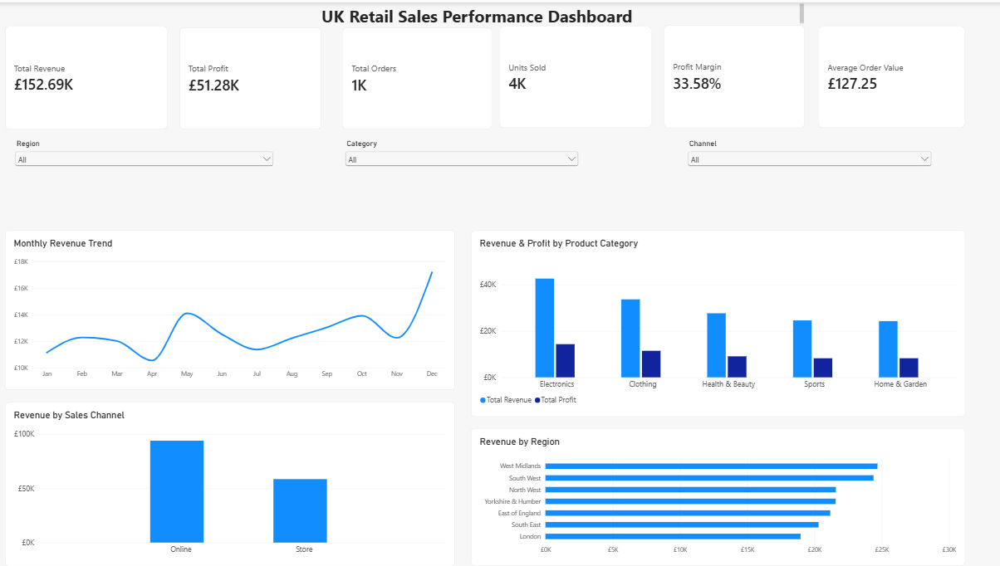

# UK Retail Sales Performance Dashboard

## Dashboard Preview



## Project Overview

This project analyses **1,200 fictional UK retail orders from 2025** and
turns the sales data into management-focused insights using **Microsoft
Excel and Power BI**.

The project objective is to assess retail performance across revenue,
profit, orders, units sold, product categories, sales channels, UK
regions, and monthly trends, then present the results in a one-page
Power BI dashboard.

> **Portfolio note:** The dataset is fictional and is used for learning
> and portfolio demonstration. The findings should not be interpreted as
> performance data for a real business.

## Tools

-   Microsoft Excel
-   Power BI
-   PivotTables
-   KPI analysis
-   Data validation and cleaning
-   Business data visualisation
-   Retail sales analysis

## Dataset

The Excel workbook contains **1,200 orders** with fields including:

-   Order ID
-   Order Date
-   Region
-   Channel
-   Category
-   Product
-   Quantity
-   Unit Price
-   Discount
-   Revenue
-   Cost
-   Profit

The data covers multiple UK regions, Online and Store sales channels,
and five retail categories.

## Project Workflow

### 1. Data Quality Checks

The project workflow includes checking:

-   Order IDs for duplicates
-   Blank or missing values
-   Order date validity
-   Quantity values
-   Revenue, Cost, and Profit data types
-   Whether `Profit = Revenue - Cost`

### 2. Excel Analysis

Excel was used to calculate and analyse the main business KPIs and
create PivotTable-based summaries for areas such as:

-   Revenue by region
-   Monthly revenue
-   Revenue and profit by category
-   Revenue by sales channel

### 3. Power BI Dashboard

The analysed retail data was used to build a **one-page Power BI sales
performance dashboard** for management reporting and visual analysis.

## Core KPIs

  KPI                          Result
  --------------------- -------------
  Total Revenue           £152,694.74
  Total Profit             £51,278.19
  Total Orders                  1,200
  Units Sold                    3,685
  Profit Margin                 \~34%
  Average Order Value         £127.25

## Business Questions

The project was designed to answer:

1.  Which UK region generates the most revenue?
2.  Which products generate the most profit?
3.  Does the Online or Store channel perform better?
4.  Which months generate the strongest revenue?
5.  Which categories have the strongest profit performance?

## Key Insights

### Regional performance

**West Midlands** generated the highest revenue at approximately
**£24.69K**, followed closely by **South West** at approximately
**£24.39K**.

### Category performance

**Electronics** generated the highest category revenue at approximately
**£42.61K** and the highest category profit at approximately
**£14.31K**.

### Sales channel performance

**Online** generated approximately **£94.09K** in revenue compared with
approximately **£58.60K** from **Store** sales, making Online the
stronger channel by revenue in this dataset.

### Monthly performance

**December** was the strongest month, generating approximately
**£17.18K** in revenue. This was the highest monthly revenue recorded in
the 2025 dataset.

### Overall profitability

The dataset generated approximately **£51.28K profit** from **£152.69K
revenue**, corresponding to an overall profit margin of roughly **34%**.

## Repository Structure

``` text
uk-retail-sales-performance-dashboard/
│
├── README.md
├── Project_1_UK_Retail_Sales_Dashboard.xlsx
├── UK_Retail_Sales_Performance_Dashboard.pbix
└── screenshots/
    └── dashboard.png
```

## Files

### Excel Workbook

`Project_1_UK_Retail_Sales_Dashboard.xlsx`

Contains the sales dataset, KPI analysis, sales analysis, regional
analysis, project brief, and project tasks.

### Power BI Dashboard

`UK_Retail_Sales_Performance_Dashboard.pbix`

Contains the Power BI report created from the retail sales analysis.

## Skills Demonstrated

This project demonstrates practical entry-level Data Analyst / BI
Analyst skills, including:

-   Inspecting and validating transactional data
-   Calculating business KPIs
-   Using Excel PivotTables for analysis
-   Comparing performance across regions, categories, channels, and time
-   Translating raw sales data into management insights
-   Building a Power BI dashboard for business reporting

## Portfolio Summary

**UK Retail Sales Performance Dashboard \| Excel, Power BI**

Analysed 1,200 fictional UK retail transactions using Excel and Power
BI. Performed data-quality checks, calculated key sales KPIs, and
analysed revenue and profit across regions, categories, channels, and
monthly trends. Built a one-page Power BI dashboard to communicate
retail performance and management insights.
